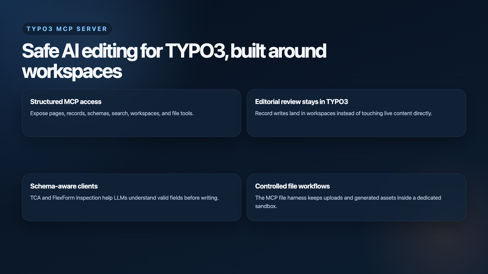

# TYPO3 MCP Server

TYPO3 MCP Server exposes TYPO3 pages, records, schemas, workspaces, and
selected file operations through the
[Model Context Protocol](https://modelcontextprotocol.io/). It gives MCP
clients and LLMs a structured TYPO3 interface without bypassing TYPO3 core
APIs, permissions, or editorial review workflows.

**TYPO3 v14:** This line targets **TYPO3 v14** first. Expect **ongoing change**
as the ecosystem matures: MCP tool names, JSON schemas, OAuth hardening, and
TYPO3 core APIs **must and will** be adjusted across releases when that improves
security, clarity, or real editor workflows. Pin versions in Composer for
production sites and read release notes when upgrading.

**Current rollout recommendation:** The extension is already useful for pilots,
internal tooling, and supervised editorial workflows. At the same time, the
MCP and TYPO3 integration surface is still moving quickly, so this repository
should not yet be treated as a fully production-ready, long-term-stable package
for broad unattended rollout. Validate changes in staging first and pin
versions deliberately.

This extension is built for real editor-facing work:

- navigate the page tree and inspect page context
- read and write workspace-capable TYPO3 records
- inspect TCA and FlexForm schemas before writing
- work with translations using ISO language codes where available
- search content across tables and media files across all FAL storage
- manage files inside a dedicated MCP file sandbox
- review pending workspace changes before publishing
- copy/duplicate records preserving relations and file references
- audit content for SEO and quality issues
- read system logs for diagnostics
- execute safe TYPO3 CLI maintenance commands
- connect remote clients over HTTP/OAuth or local clients over stdio

## Recent TYPO3 v14 updates

The latest maintenance round tightened and clarified the extension in a few
important ways:

- **TYPO3 v14-only alignment**: CI, docs, and project messaging now consistently
  target TYPO3 v14 and PHP 8.2+.
- **MCP endpoint hardening**: request logging redacts sensitive headers and
  query tokens, query-string bearer token auth is disabled by default, and the
  lightweight auth-header diagnostic is now minimal and configurable.
- **Clearer MCP ergonomics**: tool descriptions, JSON Schema hints, annotations,
  pagination guidance, and unknown-tool handling were aligned more closely with
  current MCP best-practice guidance.
- **Stronger file safety**: URL-based uploads are documented and tested as
  sandbox-bound operations with SSRF and size safeguards.
- **Terminology and config cleanup**: the old "file harness" wording is now
  consistently called "file sandbox", and the primary extension setting is now
  `fileSandboxRoot`.
- **Documentation cleanup**: historical audit-note dumps were removed; the
  canonical security and architecture references are now the maintained docs in
  `Documentation/Architecture/` plus `TECHNICAL_OVERVIEW.md`.

## Why it exists

TYPO3 backends are optimized for people using forms, trees, and list modules.
LLMs need explicit tools, stable identifiers, and machine-readable schemas.
This extension maps MCP calls back to TYPO3 concepts instead of trying to make
AI interact with backend HTML.

The core contract is:

1. MCP clients talk to tools, not to rendered TYPO3 forms.
2. TYPO3 remains the source of truth for permissions, TCA, workspaces,
   language handling, and DataHandler behavior.
3. Editors still review and publish changes through normal TYPO3 workflows.

## Architecture at a glance

The implementation is split into a few clear layers:

- Connection layer:
  `Classes/Http/` exposes the remote MCP endpoint plus OAuth discovery,
  authorization, and token endpoints. `Classes/Command/McpServerCommand.php`
  exposes a local stdio server for development and trusted local clients.
- MCP runtime:
  `Classes/MCP/McpServerFactory.php` builds the MCP server and registers
  handlers. `Classes/MCP/ToolRegistry.php` auto-registers every tool tagged via
  Symfony DI.
- Tool layer:
  `Classes/MCP/Tool/` contains page, search, workspace, and file tools.
  `Classes/MCP/Tool/Record/` contains the TCA-driven record tools.
  `AbstractRecordTool` injects the optional `workspace_id` parameter and
  switches workspace context before the tool executes.
- Shared services:
  `WorkspaceContextService` handles workspace selection/creation and context
  switching, `TableAccessService` is the central TCA/permission gate,
  `LanguageService` maps TYPO3 languages to ISO codes, `McpFileSandboxService`
  enforces the file sandbox, `SiteInformationService` resolves domains and URLs,
  and `OAuthService` manages auth codes and hashed access tokens.
- TYPO3 core integration:
  writes go through `DataHandler`, table/schema introspection uses TCA and
  `TcaSchemaFactory`, page language overlays use `PageRepository`, and file
  handling goes through TYPO3 FAL.

Tool design (schemas, MCP annotations, pagination hints, errors) is aligned with
common MCP server guidance; see **§ MCP ergonomics (mcp-builder alignment)** in
[`TECHNICAL_OVERVIEW.md`](TECHNICAL_OVERVIEW.md) and
[`Documentation/Tools/Index.rst`](Documentation/Tools/Index.rst).

## Behavioral guarantees

### Workspace transparency

Record-backed MCP writes are workspace-first.

- Clients can explicitly choose a workspace by passing `workspace_id` on
  record-backed tools.
- If `workspace_id` is omitted and the authenticated backend user is already in
  a non-live workspace, that workspace is kept.
- Otherwise the extension selects the first writable workspace.
- If none exists and the user is allowed to create one, the extension creates
  an MCP workspace automatically.
- MCP clients keep using stable, live-facing UIDs while the extension resolves
  internal workspace versions behind the scenes.

This behavior is implemented in `WorkspaceContextService`, the record-tool base
class, and the custom workspace restriction logic under
`Classes/Database/Query/Restriction/`.

### TCA-first contracts

The tool interface is derived from TYPO3 TCA, not from handwritten per-table
adapters. That gives the MCP client:

- field labels and descriptions TYPO3 editors already use
- field visibility filtered through permissions and TSconfig
- correct type handling for record subtypes, palettes, relations, and FlexForms
- compatibility with TYPO3 core tables and third-party extensions such as
  `georgringer/news`

### Language-aware, but only when TYPO3 supports it

Language parameters are not exposed unconditionally.

- Tools only add `language` parameters when more than one language is available
  in the site configuration.
- `WriteTable` accepts ISO language codes such as `de` and `fr` for
  `sys_language_uid`.
- Page overlays use TYPO3 `PageRepository` APIs, while workspace overlays stay
  in custom transparency logic.

If an instance has no meaningful language setup, translation-specific behavior
is hidden instead of being exposed as half-working parameters.

### File operations use a file sandbox, not file versioning

File tools are intentionally constrained to a dedicated MCP file sandbox, which
defaults to:

```text
1:/mcp/
```

This usually maps to:

```text
fileadmin/mcp/
```

Important TYPO3 rule: physical files are not workspace-versioned.

The extension is explicit about that:

- `BrowseFiles`, `ReadFileMetadata`, `WriteFile`, `UploadFile`, and
  `UploadFileFromUrl` are restricted to the sandbox root
- uploads can be routed into workspace-specific subfolders
- file references remain workspace-versioned records
- the underlying file still exists immediately once written or uploaded

## Available tools

### Discovery and navigation

- `GetPageTree`
- `GetPage`
- `ListTables`
- `Search`
- `SearchMedia` — search files across all FAL storage by metadata, type, or
  dimensions

### Schema and reading

- `ReadTable`
- `GetTableSchema`
- `GetFlexFormSchema`

### Writing

- `WriteTable`
- `CopyContent` — duplicate records via DataHandler, preserving file references
  and relations

### Content quality and diagnostics

- `ContentAudit` — scan page trees for missing meta descriptions, alt text,
  empty content, and pages without content
- `GetSystemLog` — read TYPO3 system log entries for debugging failed
  operations and recent errors

### Files

- `BrowseFiles`
- `ReadFileMetadata`
- `WriteFile`
- `UploadFile`
- `UploadFileFromUrl`

### Workspaces

- `ListWorkspaces`
- `WorkspaceReview` — review all pending changes in a workspace with
  field-level diffs before publishing
- `PublishWorkspace` — publish pending workspace changes to live (dry-run by
  default for safety)

### Batch operations

- `BulkWrite` — execute multiple create/update/delete operations in a single
  DataHandler transaction (max 50 per call)

### System maintenance

- `SafeCli` — execute whitelisted TYPO3 CLI commands (cache:flush,
  extension:list, site:list, referenceindex:update)

## Authentication and client setup

The extension supports two connection models:

- remote MCP over HTTP with OAuth 2.1 style flows and PKCE
- local stdio MCP via `vendor/bin/typo3 mcp:server`

The backend module under `User > MCP Server` is the operator-facing entry
point. It exposes:

- the MCP endpoint URL
- OAuth/client setup instructions
- token management
- health checks for discovery endpoints

## Installation

Install with Composer:

```bash
composer require hn/typo3-mcp-server
vendor/bin/typo3 extension:activate mcp_server
```

Requirements:

- TYPO3 `^14.0`
- PHP `>=8.2`
- `typo3/cms-workspaces`

Before connecting an MCP client, make sure the target backend user has:

- the backend module available
- page mounts for the content area it should work on
- table permissions for the records it should manage
- access to a writable workspace, or permission for automatic workspace
  creation

## Configuration

The two most important extension settings are:

- `fileSandboxRoot`
  Combined folder identifier for the MCP file sandbox. Default: `1:/mcp/`
- `workspaceUploadSubfolders`
  When enabled, uploads are stored below workspace-specific folders such as
  `1:/mcp/workspaces/ws-3/`
- `allowMcpTokenInQueryString`
  Off by default. Only enable this if you explicitly need legacy query-string
  bearer tokens and accept the related proxy/logging risk.
- `enableMcpAuthHeaderDiagnostic`
  Controls the lightweight backend-module auth-header diagnostic. Enabled by
  default, but intentionally minimal and suitable for hardening if disabled.

These settings do not change TYPO3 core file semantics. They only constrain and
organize MCP-driven file work.

## Testing and quality

The repository has three complementary test layers:

- unit tests for focused services such as OAuth hashing and file sandbox path
  handling
- TYPO3 functional integration tests for tool behavior, permissions, language
  overlays, workspace transparency, file sandbox restrictions, and write flows
- LLM-oriented tests under `Tests/Llm/` that use real models to verify that the
  tool contracts are intuitive in realistic multi-step workflows

Run the default test suite:

```bash
ddev exec composer test
```

Additional useful commands:

```bash
composer test:llm
composer docs:check   # RST render check; needs Docker (see “Documentation” below)
composer phpstan
```

The functional suite already covers important extension-level scenarios:

- workspace selection, transparent live/workspace UID handling, and delete
  placeholders
- multilingual reads, writes, and overlay behavior
- non-admin permission filtering
- file sandbox browsing, writes, metadata, and uploads
- MCP endpoint security defaults and URL upload safety checks
- extension compatibility with `georgringer/news`
- media search across FAL storage with metadata and dimension filters
- content audit checks for SEO and quality issues
- system log reading with severity/component/date filtering
- workspace change review with field-level diffs
- record duplication via CopyContent with overrides
- CLI command validation, argument allowlisting, and shell injection rejection
- workspace publishing with dry-run preview and live execution
- bulk write operations with per-operation result tracking

## Repository map

- `Classes/MCP/`
  MCP server factory, tool registry, and tool implementations
- `Classes/Service/`
  workspace, TCA access, language, file sandbox, site, and OAuth services
- `Classes/Http/`
  remote MCP endpoint and OAuth/discovery endpoints
- `Configuration/`
  service wiring, backend module registration, middleware, and routes
- `Documentation/`
  TYPO3 RST documentation
- `TECHNICAL_OVERVIEW.md`
  long-form design rationale and usage scenarios
- `Tests/`
  unit, architecture, TYPO3 functional, and LLM-assisted tests
- `remotion/`
  source for the bundled feature-tour video

## Feature tour

A rendered feature video is included in the repository:

- video: `Documentation/Media/typo3-mcp-server-feature-tour.mp4`
- poster: `Documentation/Images/FeatureTourPoster.png`

[](Documentation/Media/typo3-mcp-server-feature-tour.mp4)

## Documentation

### Render documentation locally

`composer docs:check` runs the official TYPO3 documentation container and fails
on RST issues:

```bash
composer docs:check
```

This spawns `ghcr.io/typo3-documentation/render-guides` via Docker on the machine
where you run the command (project directory is bind-mounted). It does **not**
use the PHP interpreter from DDEV—use a host shell with Docker available (e.g.
Docker Desktop).

**DDEV and PHP:** For Composer scripts that run PHP on this project (`composer test`, `composer phpstan`, …), use a DDEV PHP version that matches the extension requirement (**PHP ≥ 8.2**). The repo ships `.ddev/config.yaml` with `php_version` (e.g. `8.3`); change it if needed, then restart:

```bash
ddev config --php-version=8.3
ddev restart
ddev exec composer test
```

### Doc sources

Start with:

- `Documentation/Index.rst`
- `Documentation/Introduction/Index.rst`
- `Documentation/Installation/Index.rst`
- `Documentation/Configuration/Index.rst`
- `Documentation/Tools/Index.rst`
- `Documentation/Architecture/Index.rst`

Implementation details and design rationale:

- [`TECHNICAL_OVERVIEW.md`](TECHNICAL_OVERVIEW.md)
- [`Documentation/Architecture/WorkspaceTransparency.rst`](Documentation/Architecture/WorkspaceTransparency.rst)
- [`Documentation/Architecture/LanguageOverlays.rst`](Documentation/Architecture/LanguageOverlays.rst)
- [`Documentation/Architecture/InlineRelations.rst`](Documentation/Architecture/InlineRelations.rst)

Canonical maintained security/reference docs:

- [`Documentation/Architecture/SecurityAudit.rst`](Documentation/Architecture/SecurityAudit.rst)
- [`Documentation/Architecture/ImplementationOverview.rst`](Documentation/Architecture/ImplementationOverview.rst)

## Acknowledgements

**Thank you to [hauptsacheNet](https://github.com/hauptsacheNet)**, and in
particular to **Marco Pfeiffer**, for creating and sharing the original TYPO3
MCP Server. The original architecture established a strong TYPO3-native,
editor-first foundation: workspace-safe, practical, and unusually clear in its
direction. This project builds on that work with professional respect.

## License

GPL-2.0-or-later
