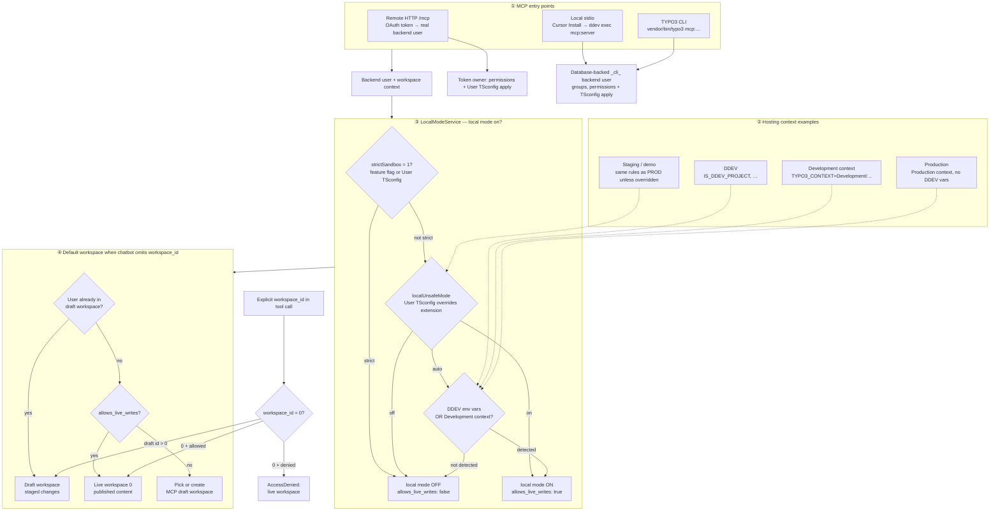

# TYPO3 MCP Server

[Model Context Protocol](https://modelcontextprotocol.io/) server for
**TYPO3 v14**: structured, workspace-safe tools for pages, records,
TCA/FlexForm schemas, file handling, and editorial workflow — over MCP for
LLM clients (Cursor, Claude Desktop, …) and over the TYPO3 CLI for shell
scripts and CI.

The server is dual-era: it serves the published MCP `2025-11-25` lifecycle
and the locked `2026-07-28` release candidate from the same stdio or HTTP
endpoint. Stable clients keep working while RC-capable clients can use
stateless requests and `server/discover`.

**Built on** the editor-first design of
[hauptsacheNet/typo3-mcp-server](https://github.com/hauptsacheNet/typo3-mcp-server)
by [Marco Pfeiffer](https://github.com/hauptsacheNet). This fork tracks
upstream and adds: capability-manifest enforcement, DDEV-aware local mode,
preview/render tools for the editor verification loop, a complete CLI
mirror of the MCP surface, and additional fork-only tools such as the file
sandbox, content audit, preview/render loop, local-mode ergonomics, and site
configuration helpers.

---

## Continuously Tested With Real LLMs

Every push to `main` runs a benchmark that has models from **Anthropic,
OpenAI, Mistral, and Google** actually use this MCP to perform real TYPO3
tasks. That's how we stay vendor-independent and prove the tool descriptions
convey what they claim across very different prompting styles — your AI
assistant of choice should just work, not only ours. Click any badge for the
full run-by-run history.

[


](https://docs.google.com/spreadsheets/d/18jL34ymMaUfoCtL32FauPu3n0cTbBTLKuVO7dmGSAS4/edit?usp=sharing)

## In 60 seconds

An MCP client (Cursor, Claude Desktop, n8n, Manus, MCP Inspector) connects
over OAuth to `https://your-site/mcp` and can:

- Browse the page tree and read records with TCA context.
- **Safely** edit content — writes land in a TYPO3 workspace by default.
- Attach images, translate records, copy content, publish, or roll back.
- Render a workspace preview URL or fetch the rendered HTML to verify a
  change without leaving the chat.
- Import text/Markdown/HTML and propose or create content elements.
- Audit content for missing metadata or alt text.

Every tool is available from the TYPO3 CLI: either through its dedicated
`vendor/bin/typo3 mcp:<tool-name>` shortcut or through the universal
`vendor/bin/typo3 mcp:tool <ToolName>` runner. CLI commands support `--json`,
`--plain`, and `--no-ansi` output modes for shell scripting.

TYPO3 stays in control of permissions, TCA, DataHandler, workspaces, and
language overlays. The MCP client sees a clean, machine-readable surface.

**Status:** experimental surface — tool names, parameters, and defaults may
change between releases. Pin Composer versions. Validate in staging before
relying on this in production.

## Table of contents

- [Quick start](#quick-start)
- [MCP basics and protocol versions](#mcp-basics-and-protocol-versions)
- [What changed in this fork](#what-changed-in-this-fork)
- [Example session](#example-session)
- [Capabilities at a glance](#capabilities-at-a-glance)
- [CLI: every tool, every shell](#cli-every-tool-every-shell)
- [Capability manifest (security model)](#capability-manifest-security-model)
- [Schema API, Abilities, and sg_apicore](#schema-api-abilities-and-sg_apicore)
- [DDEV / local-development mode](#ddev--local-development-mode)
- [Authentication and clients](#authentication-and-clients)
- [Configuration](#configuration)
- [Development](#development)
- [Documentation](#documentation)
- [Acknowledgements](#acknowledgements)

## Quick start

While there are a lot of automated tests, TYPO3 instances are widely
different and language models are also widely different. Feel free to
[create issues here on GitHub](https://github.com/dirnbauer/typo3-mcp-server/issues)
or [share experiences in the typo3-core-ai channel](https://typo3.slack.com/archives/C091M0M7BL6).

### 1. Install

```bash
composer require hn/typo3-mcp-server
vendor/bin/typo3 extension:activate mcp_server
```

**Requirements**

- TYPO3 `^14.3` (no v12/v13 fallback paths in this fork)
- PHP `^8.3` (tested with 8.3, 8.4, and 8.5)
- `typo3/cms-workspaces`

### 2. Open the backend module

In the TYPO3 backend, go to **User → MCP Server**. The module shows:

- Your MCP endpoint URL (`https://your-site/mcp`).
- One-click setup for Cursor and ready-to-paste config for Claude Desktop,
  n8n, Manus.
- A live health check for OAuth discovery endpoints.
- Token management (create/revoke personal-access tokens).

### 3. Connect a client

| Client | Transport | Setup |
|---|---|---|
| **Cursor** | Local stdio | One-click install button starts `vendor/bin/typo3 mcp:server` without OAuth; DDEV projects use `ddev exec -p <project>` |
| **Claude Desktop** | Via `mcp-remote` proxy | Paste JSON config from the module |
| **n8n** | Remote HTTP + OAuth | Paste endpoint URL into the MCP Client node |
| **Manus** | Remote HTTP + OAuth | Paste endpoint URL |
| **MCP Inspector** | Remote HTTP | `npx @modelcontextprotocol/inspector …` |
| **Local / trusted host** | stdio | `vendor/bin/typo3 mcp:server` |
| **Shell / CI / scripts** | TYPO3 CLI | `vendor/bin/typo3 mcp:<tool-name> [--json]` or `vendor/bin/typo3 mcp:tool <ToolName> --json` |

The first remote request triggers the OAuth flow: TYPO3 logs you in with
your existing backend credentials and authorizes the client.

## MCP basics and protocol versions

MCP is JSON-RPC between an AI **host**, its MCP **client**, and a **server**
such as this TYPO3 extension. The server publishes three standard primitives:

- **Tools** perform typed operations such as `ReadTable` or `WriteTable`.
- **Resources** provide URI-addressed context, including bundled skills.
- **Prompts** are user-invoked workflow templates, commonly shown as slash
  commands.

MCP does not bypass TYPO3. OAuth identifies a backend user; TYPO3 permissions,
TCA, page mounts, workspaces, the file sandbox, and the capability manifest
still decide what can run. A minimal PHP server and a detailed explanation are
in [`Documentation/Introduction/McpBasics.rst`](Documentation/Introduction/McpBasics.rst).

| Area | Stable `2025-11-25` | RC `2026-07-28` |
|---|---|---|
| Start | `initialize` + `initialized` | Optional `server/discover`; no handshake |
| State | `Mcp-Session-Id` and optional session GET/SSE | Stateless, self-contained requests |
| Metadata | Negotiated once | Client/version/capabilities in every `_meta` |
| HTTP routing | Body-driven | `Mcp-Method`, `Mcp-Name`, designated parameters |
| Results | Stable result shape | `resultType`, `ttlMs`, `cacheScope`; MRTR/extension results |
| Schema | Earlier constrained tool schema | Full JSON Schema 2020-12 |

The project requires `logiscape/mcp-sdk-php:^2.0.0-beta3`; the lock file
currently fixes beta3 while allowing a tested final 2.0 update later.

As of **2026-07-11**, Codex, Cursor, Claude Desktop, and Claude Code do not
publish a dependable dated matrix confirming the locked RC wire format in
their generally available builds. This is not evidence that they cannot
support it: inspect whether the installed client sends `server/discover` or
`initialize`. Stable fallback remains enabled. See the
[full migration table](Documentation/Architecture/ProtocolMigration.rst).

## What changed in this fork

This repository is the TYPO3 v14-focused maintained line of the original
hauptsacheNet MCP server. Compared with `upstream/main`, the current branch
adds and hardens these areas:

- **TYPO3 v14 foundation** — Composer constraints, services, TCA schema usage,
  workspaces, DataHandler calls, and tests are aligned with TYPO3 v14 only.
  There are no v12/v13 compatibility paths documented for this fork.
- **Dual-era MCP v2 runtime** — one endpoint serves stable `2025-11-25`
  initialization/session clients and stateless `2026-07-28` release-candidate
  clients. Typed catalogs carry modern cache hints, and JSON tool results gain
  `structuredContent` without losing stable text.
- **Workspace-aware editorial tool surface** — strict/production writes select
  or create TYPO3 drafts, trusted local writes default to live unless given a
  draft ID, and both paths keep live-facing UIDs stable while hiding internal
  version rows from MCP clients.
- **Remote and local transports** — `/mcp` supports OAuth 2.1 + PKCE, protected
  resource metadata, dynamic client registration, streamable HTTP sessions, and
  a local stdio server for trusted development clients.
- **Backend module** — **User -> MCP Server** now provides endpoint discovery,
  client setup snippets, token management, health checks, and workspace/context
  warnings using XLIFF 2 labels in English and German.
- **Capability manifest** — public fields stay compatible with the archived
  version 1.0 proposal; `x-mcp` inventories exact tools, commands, skills,
  protocol eras, integrations, runtime requirements, and outbound policy.
  Local services and consistency tests enforce it.
- **TYPO3 v14 Schema API** — `TableAccessService` centralizes
  `TcaSchemaFactory`/`TcaSchemaCapability` semantics while preserving explicit
  permissions and web-mount checks.
- **Prompts, resources, and skills** — bundled workflows are always available
  as `typo3-mcp:///skills` resources and as standard MCP prompts. CLI mirrors
  prompt discovery and rendering.
- **Optional Abilities + REST/OpenAPI** — five governed abilities expose native
  tool list/describe/execute operations plus bundled-skill list/get operations;
  the four read-only abilities are REST-enabled and generic execution remains
  on native MCP/CLI so arbitrary arguments never enter the upstream REST trace.
  The TYPO3 v14 `sg_apicore` fork can expose them with backend-user tokens,
  scopes, tenants, rate limits, request IDs, redacted logs, and generated
  OpenAPI.
- **DDEV/local mode** — `LocalModeService` detects DDEV or TYPO3 Development
  context and can relax workspace-only writes, non-workspace-table writes, FAL
  sandbox limits, and outbound-network gates for local work. Production stays
  strict by default.
- **CLI mirror** — every bundled MCP tool has a Symfony console command, plus
  `mcp:tool <Name>` and `mcp:tool:list` for generic automation. CLI output can
  be pretty, plain text, or JSON.
- **Expanded tools** — the fork adds file sandbox tools, FAL search/browse
  tools, workspace review/publish/rollback, import/audit helpers, preview and
  render verification, site configuration helpers, safe CLI execution, optional
  x402 tools, and dev-site tools for Site Sets, ViewHelpers, TCA resources, and
  XLF authoring.
- **Editor access on site creation** — `CreateSite` provisions a dedicated
  per-site backend editor group (mounted at the root, with content-editing
  permissions and page ownership) instead of granting the new site to every
  existing editor, optionally seeded with named `editors`, and extends
  page-tree–restricted workspaces to cover the new root for staging.
- **Security hardening** — tokens are hashed, query-string bearer
  authentication is removed, exact browser origins are checked before auth,
  the auth-header diagnostic is off by default, sensitive HTTP logs are
  redacted, PKCE requires `S256`, consent is CSRF-protected, authorization
  responses are issuer-bound, refresh-token replay revokes the token family,
  browser-defense headers and body limits are set, unsafe system columns are
  rejected, SVG text writes are not allowed by default, and outbound HTTP has
  DNS-pinned A/AAAA SSRF checks outside local mode.
- **Quality gates** — PHPUnit unit/functional suites, PHPStan, PHP CS Fixer,
  Rector, Fractor, Playwright E2E tests, architecture tests, and real LLM
  workflow tests are wired into the development and CI flow.

The detailed manual page is
[`Documentation/Introduction/ForkChanges.rst`](Documentation/Introduction/ForkChanges.rst).
It intentionally describes the current live implementation only, not obsolete
experiments or generated build output.

## Example session

What an "add a news article on page 42" conversation looks like at the
tool-call level. The MCP client drives these calls; you only write a
natural-language prompt.

```text
USER: Add a news article "Spring Sale" on the News page with a short teaser.
```

```jsonc
// 1. Discover context
GetCapabilities {}                                 // know what's allowed
ListWorkspaces  {}                                 // choose writable draft 3; this call never creates one
GetPageTree     { "startPage": 1, "depth": 3, "workspace_id": 3 }
ListTables      { "workspace_id": 3 }
GetTableSchema  { "table": "tx_news_domain_model_news", "workspace_id": 3 }

// 2. Write into the selected draft (especially important in local mode)
WriteTable {
  "table": "tx_news_domain_model_news",
  "action": "create",
  "pid": 42,
  "workspace_id": 3,
  "data": {
    "title":    "Spring Sale",
    "teaser":   "30% off selected items for two weeks.",
    "datetime": "2026-04-20"
  }
}
// → { "action": "create", "table": "tx_news_domain_model_news", "uid": 1234, "pid": 42 }

// 3. Verify before publishing
GetPreviewUrl { "table": "tx_news_domain_model_news", "uid": 1234, "workspace_id": 3 }
RenderRecord  { "pageId": 42, "mode": "text", "maxLength": 5000, "workspace_id": 3 }

// 4. Review and publish
WorkspaceReview  { "workspace_id": 3 }
PublishWorkspace { "workspace_id": 3, "dryRun": true }
PublishWorkspace { "workspace_id": 3, "dryRun": false }
```

The live UID `1234` is stable across workspace and live — MCP clients never
see the internal workspace version ID.

## Capabilities at a glance

The extension declares **45 bundled native MCP tools** across these groups.
Optional extensions can add more tagged tools at runtime. For the authoritative
native list with parameters, see
[`Documentation/Tools/Index.rst`](Documentation/Tools/Index.rst). The same
tool-to-subsystem map is also exposed by the `GetCapabilities` tool, gated by
[`Configuration/Capabilities.yaml`](Configuration/Capabilities.yaml).

- **Discovery & schema** — `GetCapabilities`, `ListTables`, `GetTableSchema`,
  `GetFlexFormSchema`
- **Navigation & search** — `GetPageTree`, `GetPage` (`uid`, `pageId`, or
  `url`), `Search` (accepts `query` or `terms`)
- **Read & write records** — `ReadTable` (structured `filters` with
  `sys_language_uid` ISO codes and boolean `hidden`), `WriteTable`,
  `BulkWrite`, `CopyContent`, `AttachImage`
- **Verification** — `GetPreviewUrl` (signed workspace preview link),
  `RenderRecord` (fetches the FE HTML so the LLM can see the result)
- **Content import** — `ImportContent`, `ImportFromUrl`
- **Workspace workflow** — `ListWorkspaces`, `WorkspaceReview`,
  `PublishWorkspace` (supports `tables` list and `onlyTranslations`),
  `RollbackWorkspace`
- **Files (sandboxed)** — `BrowseFolder`, `BrowseFiles`, `WriteFile`,
  `UploadFile`, `UploadFileFromUrl`, `ReadFileMetadata`, `SearchFile`,
  `SearchMedia`, `ListStorages`
- **Diagnostics** — `ContentAudit`, `GetSystemLog`, `ManageRedirects`
- **Admin / operations** — `CreateSite`, `SiteSet`, `SafeCli`, `SolrIndexQueue`
- **Dev-site only (DDEV / `localUnsafeMode`)** — `SiteSettings`, `ListViewHelpers`,
  `GetViewHelperDocumentation`, `CreateLocallang`, `InstallExtension`,
  `ApplyShadcnPreset`, MCP TCA resources
  (`typo3-mcp:///tca`, `typo3-mcp:///tca/{table}`)
- **Optional: x402 monetization** — `ListPaidContent`, `GetPaidContent`,
  `GetPaymentStats`. These tools fail closed unless a compatible paywall
  release supplies the TYPO3 x402 configuration/model APIs. Do not co-install
  `typo3-x402-paywall` 1.0.2: it requires `mcp/sdk:^0.5`, whose `Mcp\` classes
  collide with this server's `logiscape/mcp-sdk-php` runtime. Composer now
  rejects that unsafe package combination until the paywall removes or
  migrates its SDK dependency.

### Frontend design-system tooling

`ApplyShadcnPreset` is a dev-site/admin-only helper for applying a copied
shadcn/create preset to an existing frontend project directory. The MCP server
does not own TYPO3 Fluid template sets or Desiderio's frontend component
recipes; those stay in the consuming sitepackage where Visual Editor content
areas, site settings, CSS tokens, and template overrides can evolve together.

### Dev-site tools (DDEV / local development)

Dev-site tools use the **same** `localMode` gate as live workspace writes and
unrestricted file access (see [DDEV / local-development mode](#ddev--local-development-mode)
below). When `localUnsafeMode` resolves to **on** — via DDEV, TYPO3
Development context, or explicit `localUnsafeMode=on` — the MCP server also
exposes tools that stay hidden on production endpoints. Record tools **default
to the live workspace** when `workspace_id` is omitted (major local-dev
change; production unchanged). See
[`Documentation/Configuration/LiveEditsOnDevelopment.rst`](Documentation/Configuration/LiveEditsOnDevelopment.rst)
for a plain-language guide and per-user opt-out. **Production override**
(DDEV-like live chatbot edits on a non-DDEV server) is documented in the same
guide — use with extreme care. `mcpServer.strictSandbox`
turns all relaxations off, including dev-site tools, even inside DDEV.

| Tool | Purpose |
|------|---------|
| `SiteSettings` | List Site Set setting definitions; read/update `settings.yaml` |
| `ListViewHelpers` / `GetViewHelperDocumentation` | Fluid ViewHelper reference |
| `CreateLocallang` | Create or extend XLF files in extensions |
| MCP resources | `typo3-mcp:///tca` overview + `typo3-mcp:///tca/{table}` with access checks |

`GetCapabilities` reports `devSiteTools.available` alongside `localMode`.
Bundled skills are static and remain available as MCP resources/prompts even
when dev-site tools are off:

```bash
vendor/bin/typo3 mcp:prompt:list
vendor/bin/typo3 mcp:prompt:get typo3-content-edit \
  --request='Update page 42' --context='Review before publishing'
```

For hosts that consume filesystem skills directly, install copies for Claude
Code / OpenCode:

```bash
vendor/bin/typo3 mcp:install-editor-skills
# DDEV: ddev typo3 mcp:install-editor-skills
```

This copies `typo3-content-edit` and `typo3-translate-page` into
`.claude/skills/`. The standard MCP projections remain the portable option:
resources under `typo3-mcp:///skills` and prompts with the same names.

CLI shortcuts (dev-site / DDEV):

```bash
ddev typo3 mcp:site-settings --action=listDefinitions --identifier=main --json
ddev typo3 mcp:list-viewhelpers --json
ddev typo3 mcp:get-viewhelper-documentation --tagName=f:for --json
ddev typo3 mcp:create-locallang --extensionKey=my_ext --fileName=locallang.xlf \
  --params '{"transUnits":[{"id":"label","source":"Label"}]}' --json
ddev typo3 mcp:tca-resource --json                    # MCP resource typo3-mcp:///tca
ddev typo3 mcp:tca-resource --table=pages --json      # typo3-mcp:///tca/pages
ddev typo3 mcp:install-extension --action=list --json
ddev typo3 mcp:install-editor-skills
```

### Adding a site configuration

`CreateSite` accepts a live root page UID and an optional rendering definition
so the frontend renders with the intended theme out of the box. Site
configuration is YAML-backed and not workspace-versioned, so prepare or
publish the root page before pointing a site config at it.

```jsonc
CreateSite {
  "action": "create",
  "identifier": "launch-2026",
  "rootPageId": 474,
  "base": "https://example.com/",
  "dependencies": ["webconsulting/desiderio-preset-corporate"],
  "settings": { "theme": { "accent": "violet" } },
  "editors": ["alice", "bob"]   // optional: add them to the new editor group
}
```

Need to add the theme later? `action: "update"` merges top-level keys into
an existing site config without touching unrelated entries.

If no Site Set/theme/site package is available and there is no root
`sys_template`, `CreateSite` creates a minimal site-level `setup.typoscript`
fallback in TYPO3's active site configuration path, so a newly added website
can still render content immediately.

**Editor access is wired up automatically.** On `create`, `CreateSite` also
makes the new website editable by non-admins **without** opening it up to every
existing editor team:

- A **dedicated backend group** `Editors: <root page title>` is provisioned
  (or reused) — mounted at the new root page, with content-editing rights for
  `pages`/`tt_content`, the editor page types, the Page + List modules, and an
  allow-list of every registered content type (so editors can actually add
  content). Pass `editors` (existing non-admin usernames) to add members now;
  admins manage membership later. Access is granted purely by group membership —
  no other team is touched.
- The editor group is made the **owner-group of the root page** so its members
  may edit there (non-destructive: an existing owner on a pre-existing root page
  is kept).
- Workspaces **restricted** to specific page trees are **extended** to cover the
  new root so the site can be staged there; unrestricted workspaces already
  reach it and are left alone.

The response reports all of this under `access` (`editorGroup`,
`pagePermissions`, `editors`, `workspaces`). The `mcp:create-site` CLI command
shares the exact same behavior.

### Translating a page in one call

Translations are visible by default (`hidden=0`). Pass `hidden: true` to
keep them in review. Inline children are auto-localized by TYPO3 unless you
opt out with `translateChildren: false`.

```jsonc
WriteTable {
  "action": "translate",
  "table": "pages",
  "uid": 474,
  "data": { "sys_language_uid": "hu", "title": "Esemény", "slug": "/esemeny" }
}
// → { "translationUid": 1234, "targetLanguage": "hu",
//     "siteIdentifier": "launch-2026", "slug": "/esemeny", "hidden": false }
```

### Core guarantees

- **Workspace transparency** — strict/production writes stage in a selected or
  automatically provisioned TYPO3 draft. Trusted local mode defaults an
  omitted `workspace_id` to live workspace `0`; pass a draft ID to stage
  locally. MCP clients see stable live UIDs in either mode.
- **TCA-first** — tool schemas come from TCA, not from handwritten adapters.
  Field labels, permissions, palettes, FlexForms, and third-party
  extensions like `georgringer/news` work out of the box.
- **Language-aware** — translation parameters only appear when the site has
  more than one language. ISO codes (`de`, `fr`) are accepted.
- **File sandbox** — file tools are restricted to `fileadmin/mcp/` by
  default. Physical files are not workspace-versioned; only file references
  are.
- **Dry-run by default** — `PublishWorkspace` and `RollbackWorkspace` show
  what would happen unless `dryRun: false`.
- **Capability-manifest enforcement** — every tool declares its required
  subsystems (`database:write`, `file:write`, `render:frontend`, …).
  Removing a subsystem from `Configuration/Capabilities.yaml` disables every
  tool that needs it. Direct outbound HTTP defaults to `self` only;
  subprocess-owned package-manager and configured scheduler network effects
  are separate declared subsystems.

## CLI: every tool, every shell

Every MCP tool is available from the TYPO3 CLI, so the same surface is
available to shell scripts, CI pipelines, and `ddev exec`. Three output modes:

```sh
# Pretty (humans):
ddev exec ./vendor/bin/typo3 mcp:read-table --table tt_content --pid 1

# Plain text only (logs, redirects):
ddev exec ./vendor/bin/typo3 mcp:read-table --table tt_content --pid 1 --plain
ddev exec ./vendor/bin/typo3 mcp:read-table --table tt_content --pid 1 --no-ansi

# JSON envelope `{ok, result}` (jq, agents, CI):
ddev exec ./vendor/bin/typo3 mcp:read-table --table tt_content --pid 1 --json | jq '.result'
```

Every tool also accepts `--param key=value` (repeatable) and
`--params <json>` for arbitrary input. Use `--param data=@payload.json` to
read JSON from a file (constrained to the project root for safety).

```sh
ddev exec ./vendor/bin/typo3 mcp:tool:list             # discover tools
ddev exec ./vendor/bin/typo3 mcp:tool:list --schema=ReadTable
ddev exec ./vendor/bin/typo3 mcp:tool ReadTable --param table=pages --json
ddev exec ./vendor/bin/typo3 mcp:get-capabilities --json
ddev exec ./vendor/bin/typo3 mcp:prompt:list
ddev exec ./vendor/bin/typo3 mcp:prompt:get typo3-translate-page \
  --request='Translate page 42 to German'
```

The shipped `mcp:<tool-name>` shortcuts cover the complete bundled tool
surface, including generic shortcuts backed by `GenericMcpToolCommand`.
`mcp:tool <Name>` remains the universal runner for any registered tool,
including tools contributed by third-party extensions. Adding a new shortcut
usually means adding a `GenericMcpToolCommand` service entry; use a custom
`AbstractMcpToolCommand` subclass only when the command needs bespoke
options or formatting.

## Capability manifest (security model)

The MCP server ships [`Configuration/Capabilities.yaml`](Configuration/Capabilities.yaml).
Its public fields remain compatible with version 1.0 of the now-archived
[Capability Manifest design](https://www.webconsulting.at/blog/typo3-extension-security-emdash-capability-manifests).
The [archived v1.0 reference package](https://github.com/dirnbauer/typo3-capability-manifest/tree/v1.0.2)
is a design/schema reference, not an installed verifier.
Runtime services and consistency tests enforce this repository's policy.

```yaml
capabilities:
  version: '1.0'
  extension: mcp_server
  subsystems:
    - database:read
    - database:write
    - cache:write
    - file:read
    - file:write
    - scheduler:task
  network:
    outbound:
      - host: self
        purpose: Render configured TYPO3 sites
        protocol: https
  x-mcp:
    protocol:
      stable_version: '2025-11-25'
      preview_version: '2026-07-28'
      compatibility: dual-era
    requires:
      database:write: [database:read]
      file:write: [file:read, database:write]
      project:write: [database:write]
      network:package-manager: [project:write]
    tools:
      WriteTable: [database:write]
      UploadFileFromUrl: [file:write]
    commands:
      mcp:write-table: {kind: tool, tool: WriteTable}
    skills:
      typo3-content-edit:
        user_invocable: true
```

**Enforcement points:**

- `AbstractTool::execute()` — refuses to run a tool whose required
  subsystems (or any of their `requires:` prerequisites) are not declared.
  Removing `database:write` cascades into disabling every
  `file:write`/`workspace:write`/`site:write`/`project:write`/scheduler tool too.
- `UploadFileFromUrl`, `ImportFromUrl`, `RenderRecord`, and x402 facilitator
  verification used by `GetPaidContent` — refuse outbound requests to hosts
  not in `network.outbound`. Outside trusted local mode they also validate
  every resolved A/AAAA address, pin DNS, reject redirects, and bound response
  bodies. The x402 v2 path verifies and settles before releasing gated content
  and is used only when its optional compatible adapter and
  facilitator configuration are available.
- `InstallExtension` and `ApplyShadcnPreset` invoke Composer or a JavaScript
  package runner, which cannot be DNS-pinned by the PHP HTTP client. Both are
  hidden outside trusted dev-site mode and require the explicit
  `network:package-manager` subsystem. `SolrIndexQueue` can contact only the
  service configured in a pre-existing, UID-validated TYPO3 scheduler task and
  declares `scheduler:task` plus `network:scheduler`.

The `x-mcp.commands` inventory is compared with all registered `mcp:*`
commands in tests. A functional test also boots TYPO3 and compares the real
tool registry with native and explicitly allowlisted external entries. Tools,
owned tables, prerequisites, filesystem/events, and skill references receive
the same drift checks. To inspect the resolved policy:

```sh
ddev exec ./vendor/bin/typo3 mcp:get-capabilities --json
```

## Schema API, Abilities, and sg_apicore

Three APIs solve different problems:

- TYPO3's **Schema API** supplies facts about TCA tables. `TableAccessService`
  uses `TcaSchemaFactory` and `TcaSchemaCapability` for workspace, language,
  root-level, read-only, sorting, type, timestamp, and translation semantics.
  Backend permissions and web mounts remain separate checks.
- The **capability manifest** declares extension reach and enforces native tool
  and outbound-host policy.
- The optional **Abilities API** registers typed operations with scopes, risk,
  side effects, permission checks, and selected projections.

This extension registers five abilities when
`webconsulting/typo3-abilities` is installed:

- `typo3-mcp/list-tools` and `typo3-mcp/describe-tool` inspect the native
  catalog.
- `typo3-mcp/execute-tool` invokes a native tool through its existing gates.
- `typo3-mcp/list-skills` and `typo3-mcp/get-skill` expose the same bundled
  workflow documents used by MCP prompts and resources.

They delegate to the same native registries. The four read-only abilities are
available through CLI and REST. Generic `execute-tool` is deliberately
CLI-only because the upstream Abilities trace recorder persists complete
inputs; native MCP remains the secure remote execution surface.

The TYPO3 v14 [`sg_apicore` fork](https://github.com/dirnbauer/sg_apicore)
(installed from `dev-main`; package metadata declares 14.1.0, PHP `^8.3`, and
TYPO3 `^14.3`) can expose those abilities at `/api/abilities/v1`. It adds
backend-user-bound opaque tokens, scopes, site tenants, 60/minute rate
limiting with burst 10, request IDs, redacted logs, and OpenAPI when
`activateAbilitiesApi=1`. A strict path allowlist blocks inherited auth,
demo, health, and sg_apicore MCP routes; `/mcp` remains authoritative even if
API Core's global MCP option is enabled. OpenAPI is filtered to the allowed
surface and augmented with exact input/output components for the four
REST-exposed MCP abilities.
The ability list, describe, and run routes require a backend-user-bound bearer
token. API Core deliberately serves `/api/abilities/v1/docs.json` and
`/api/abilities/v1/docs/ui` publicly, so treat the generated schemas as public
metadata and do not put secrets in ability descriptions or examples.

Skills are not permission grants, executable workflows, or new MCP capability
flags. They are inventoried under `x-mcp`, exposed as resources/prompts, and
can be listed or read through the two read-only skill abilities. Their steps
run only when a client calls the native permitted tools. Installation, token
scopes, REST routes, and curl examples are in
[`Documentation/Integration/SgApiCore.rst`](Documentation/Integration/SgApiCore.rst).

## DDEV / local-development mode

Outside trusted local mode, MCP enforces two production safety nets:

- All record writes are staged in a workspace (no live edits).
- File operations are jailed to `fileadmin/mcp/`.

When the server detects a DDEV environment (via `IS_DDEV_PROJECT`,
`DDEV_PROJECT`, `DDEV_HOSTNAME`, or `DDEV_TLD`) **or** when TYPO3 runs in
the `Development/...` application context, the safety nets relax:

- Record tools default to the **live workspace** when `workspace_id` is omitted
  (edit published content directly). Pass an explicit draft `workspace_id` to
  stage changes locally.
- `WriteTable` also accepts `workspace_id: 0` explicitly.
- `BrowseFiles`, `WriteFile`, and `UploadFile` can leave the MCP sandbox but
  remain limited by the `_cli_`/authenticated backend user's FAL file mounts.
- File-sandbox boundary checks are bypassed (path-traversal protection
  still applies).
- The capability manifest's `network.outbound: [self]` gate is bypassed for
  `UploadFileFromUrl`, `ImportFromUrl`, `RenderRecord`, and optional x402
  facilitator verification. Their public-IP filter is also lifted so DDEV's `*.ddev.site`
  (which resolves to `127.0.0.1`) and local NAS / staging hosts work
  out of the box.

Override via extension setting `localUnsafeMode`:

| Value  | Behavior                                                                     |
|--------|------------------------------------------------------------------------------|
| `auto` | (default) on if DDEV or Development context detected, off otherwise          |
| `on`   | always relaxed — only set in trusted local environments                      |
| `off`  | always strict — production-safe                                              |

The same mode can be set per backend user or group via User TSconfig, which
allows TYPO3 conditions (recommended for opt-out on DDEV):

```typoscript
[applicationContext == "Development/DDEV" && backend.user.groupList contains "integrators"]
options.mcpServer.localUnsafeMode = on
[else]
options.mcpServer.localUnsafeMode = off
[end]
```

When `localUnsafeMode` resolves to `off`, MCP uses draft workspaces even on DDEV.

### MCP live vs draft — decision tree

Entry points (HTTP OAuth, Cursor stdio, CLI), hosting context (DDEV, Development, production, staging), and where chatbot edits land:


```mermaid
flowchart TB
    subgraph EP["① MCP entry points"]
        HTTP["Remote HTTP /mcp<br/>OAuth token → real backend user"]
        STDIO["Local stdio<br/>Cursor Install → ddev exec mcp:server"]
        CLI["TYPO3 CLI<br/>vendor/bin/typo3 mcp:…"]
    end

    subgraph ENV["② Hosting context examples"]
        DDEV["DDEV<br/>IS_DDEV_PROJECT, …"]
        DEVCTX["Development context<br/>TYPO3_CONTEXT=Development/…"]
        PROD["Production<br/>Production context, no DDEV vars"]
        STAGE["Staging / demo<br/>same rules as PROD unless overridden"]
    end

    EP --> CTX["Backend user + workspace context"]
    HTTP --> REAL["Token owner: permissions + User TSconfig apply"]
    STDIO --> CLIUSER["Database-backed _cli_ backend user<br/>groups, permissions + TSconfig apply"]
    CLI --> CLIUSER

    CTX --> POLICY

    subgraph POLICY["③ LocalModeService — local mode on?"]
        SB{"strictSandbox = 1?<br/>feature flag or User TSconfig"}
        SB -- strict --> OFF["local mode OFF<br/>allows_live_writes: false"]
        SB -- not strict --> CFG{"localUnsafeMode<br/>User TSconfig overrides extension"}
        CFG -- on --> ON["local mode ON<br/>allows_live_writes: true"]
        CFG -- off --> OFF
        CFG -- auto --> AUTO{"DDEV env vars<br/>OR Development context?"}
        AUTO -- detected --> ON
        AUTO -- not detected --> OFF
    end

    POLICY --> WS

    subgraph WS["④ Default workspace when chatbot omits workspace_id"]
        CUR{"User already in<br/>draft workspace?"}
        CUR -- yes --> DRAFT["Draft workspace<br/>staged changes"]
        CUR -- no --> ALLOW{"allows_live_writes?"}
        ALLOW -- yes --> LIVE["Live workspace 0<br/>published content"]
        ALLOW -- no --> PICK["Pick or create<br/>MCP draft workspace"]
    end

    EX["Explicit workspace_id in tool call"] --> EX0{"workspace_id = 0?"}
    EX0 -- "0 + allowed" --> LIVE
    EX0 -- "0 + denied" --> DENY["AccessDenied:<br/>live workspace"]
    EX0 -- "draft id > 0" --> DRAFT

    DDEV -.-> AUTO
    DEVCTX -.-> AUTO
    PROD -.-> AUTO
    STAGE -.-> CFG
```

Full plain-language guide: [`Documentation/Configuration/LiveEditsOnDevelopment.rst`](Documentation/Configuration/LiveEditsOnDevelopment.rst).

To force the production safety nets even in DDEV, set either the TYPO3 feature
flag `$GLOBALS['TYPO3_CONF_VARS']['SYS']['features']['mcpServer.strictSandbox']`
or User TSconfig:

```typoscript
options.mcpServer.strictSandbox = 1
```

Strict sandbox mode means file tools stay inside the configured MCP file
sandbox and record writes stay in TYPO3 workspaces. Local mode additionally
removes the workspace-capable table requirement so local-only tools can write
non-workspace tables with the current backend user's normal permissions.

OAuth, backend-user permission checks, and per-tool subsystem checks from
`Configuration/Capabilities.yaml` remain enforced. Local mode relaxes the
workspace-staging, non-workspace-table, file-sandbox, and outbound-network
safety nets; it does not turn the MCP endpoint into an unauthenticated or
ungated shell.

## Authentication and clients

Two connection models:

- **Remote HTTP** at `/mcp`, protected by OAuth 2.1 + PKCE.
  Recommended for clients that cannot start a local process: Claude
  Desktop, n8n, Manus, MCP Inspector.
- **Local stdio** via `vendor/bin/typo3 mcp:server`.
  Recommended for Cursor during local development. It runs as your OS user;
  TYPO3 gates CMS operations but does not contain the host. Use stdio with
  trusted local clients only.

The **User → MCP Server** backend module handles token creation, per-client
instructions, and endpoint health checks.

The MCP RC path is protocol-stateless; stable clients can still use an MCP
session. In both cases the extension creates only an in-memory TYPO3 backend
user session for the current request so `DataHandler` internals work without a
persistent backend login.

## Configuration

All settings live in **Extension Configuration → `mcp_server`**.

| Key                            | Default | Purpose                                                                            |
|--------------------------------|---------|------------------------------------------------------------------------------------|
| `additionalReadOnlyTables`     | `sys_file` | Comma-separated non-workspace tables exposed for reads only                     |
| `additionalStandaloneTables`   | `sys_file_metadata` | Hidden TCA tables exposed as standalone read targets instead of embedded child-only tables |
| `fileSandboxRoot`              | `1:/mcp/` | FAL folder root where file tools operate                                         |
| `workspaceUploadSubfolders`    | `1`     | Route uploads into workspace-specific folders                                      |
| `allowedOrigins`               | empty   | Additional exact HTTP(S) browser origins; same-origin is always accepted            |
| `enableMcpAuthHeaderDiagnostic`| `0`     | Enable minimal `?test=auth` diagnostic on `/mcp` (off-by-default since 2026-05)    |
| `localUnsafeMode`              | `auto`  | DDEV/Development -> live writes, unrestricted file/outbound access, and dev-site tools. `on`/`off`/`auto`; can be overridden by User TSconfig. |
| `enforceCapabilityManifest`    | `1`     | Reject tools whose required subsystems aren't declared in `Capabilities.yaml`      |
| `schemaDetail`                 | `concise` | Use concise or full descriptions in `tools/list`                                  |

Query-string bearer authentication has no setting and is never accepted. Fix
the proxy to forward `Authorization` if header authentication fails.

See [`Documentation/Configuration/Index.rst`](Documentation/Configuration/Index.rst)
for details and security recommendations.

## Development

```bash
ddev exec composer test            # unit + functional suites
ddev exec composer test:protocol   # installed stable + RC stdio smoke matrix
ddev exec composer test:llm        # LLM-assisted ergonomics tests (needs OPENROUTER_API_KEY)
ddev exec composer phpstan         # PHPStan level max + saschaegerer/phpstan-typo3
                                   # + phpstan-strict-rules + phpstan-deprecation-rules
ddev exec composer php-cs-fixer:fix
ddev exec composer rector          # PHP migrations dry-run
ddev exec composer fractor         # non-PHP (FlexForm/TypoScript/Fluid) dry-run
composer docs:check                # host Docker, not DDEV PHP
```

CI matrix runs **PHP 8.3 / 8.4 / 8.5 × TYPO3 ^14.3** on every push.

E2E (Playwright) — spins up MySQL, TYPO3, Playwright in Docker:

```bash
Build/runTests.sh -s e2e
Build/runTests.sh -s e2e --no-docker      # host PHP + SQLite + local Playwright
Build/runTests.sh -h                      # all options

# Existing TYPO3/DDEV site (after npm ci + browser install in Build/):
cd Build && TYPO3_BASE_URL=https://my.ddev.site npx playwright test
```

### Syncing with upstream

This fork tracks
[hauptsacheNet/typo3-mcp-server](https://github.com/hauptsacheNet/typo3-mcp-server).
To pull in new upstream changes:

```bash
git fetch upstream
git merge upstream/main
ddev exec composer php-cs-fixer:fix && ddev exec composer phpstan && ddev exec composer test
```

Resolve conflicts by keeping TYPO3 v14 patterns (`final class`, constructor
DI, `getToolSchema()`).

### Repository layout

```
Classes/
  MCP/         MCP server, tool registry, tool implementations
  Service/     workspace, TCA, language, file sandbox, OAuth, capability manifest, local mode
  Http/        /mcp endpoint + OAuth/discovery endpoints
  Controller/  backend module controller
  Command/     CLI commands (mcp:server, mcp:tool, per-tool shortcuts)
Configuration/
  Capabilities.yaml   declared subsystems + per-tool requirements + outbound policy
  Services.yaml       DI + console.command + event listener registration
  Commands.php        legacy/explicit command map for selected shortcuts
Documentation/        reStructuredText manual (published source)
Resources/            templates, CSS/JS, XLIFF labels (en + de)
Tests/                unit, functional, LLM, architecture, E2E
```

## Documentation

Canonical manual under `Documentation/` in reStructuredText. Suggested
reading order:

| Topic | Entry point |
|---|---|
| Overview & safety model | [`Introduction/Index.rst`](Documentation/Introduction/Index.rst) |
| MCP basics and PHP example | [`Introduction/McpBasics.rst`](Documentation/Introduction/McpBasics.rst) |
| Detailed fork changes | [`Introduction/ForkChanges.rst`](Documentation/Introduction/ForkChanges.rst) |
| What the tools promise | [`Introduction/IntendedBehavior.rst`](Documentation/Introduction/IntendedBehavior.rst) |
| Install & activate | [`Installation/Index.rst`](Documentation/Installation/Index.rst) |
| Module, OAuth, sandbox, manifest, local mode | [`Configuration/Index.rst`](Documentation/Configuration/Index.rst) |
| Full MCP tool reference | [`Tools/Index.rst`](Documentation/Tools/Index.rst) |
| Architecture deep-dives | [`Architecture/Index.rst`](Documentation/Architecture/Index.rst) |
| Stable-to-RC protocol diff | [`Architecture/ProtocolMigration.rst`](Documentation/Architecture/ProtocolMigration.rst) |
| Schema, manifest, Abilities, skills | [`Architecture/CapabilitiesAndAbilities.rst`](Documentation/Architecture/CapabilitiesAndAbilities.rst) |
| Security audit | [`Architecture/SecurityAudit.rst`](Documentation/Architecture/SecurityAudit.rst) |
| `sg_apicore` REST/OpenAPI | [`Integration/SgApiCore.rst`](Documentation/Integration/SgApiCore.rst) |
| Dual-era test matrix | [`Testing/ProtocolCompatibility.rst`](Documentation/Testing/ProtocolCompatibility.rst) |
| Complete 2026 changes | [`Changelog/Modernization2026.rst`](Documentation/Changelog/Modernization2026.rst) |
| Testing with Cursor | [`Testing/CursorTesting.md`](Documentation/Testing/CursorTesting.md) |
| Full-feature chatbot script | [`Testing/FullFeatureChatbotScript.md`](Documentation/Testing/FullFeatureChatbotScript.md) |
| E2E test suite | [`Testing/E2eSuite.rst`](Documentation/Testing/E2eSuite.rst) |
| Troubleshooting | [`Troubleshooting/Index.rst`](Documentation/Troubleshooting/Index.rst) |

Long-form design rationale and real-world scenarios:
[`TECHNICAL_OVERVIEW.md`](TECHNICAL_OVERVIEW.md).

New dedicated CLI shortcuts can be added through `GenericMcpToolCommand`
service entries in `Configuration/Services.yaml`; use a custom command class
only when a shortcut needs specialized behavior.

## Acknowledgements

Thank you to [hauptsacheNet](https://github.com/hauptsacheNet) and
Marco Pfeiffer for open-sourcing the original TYPO3 MCP Server: a strong,
editor-first, workspace-safe foundation that this project builds on. The
capability-manifest concept is adapted from
[Kurt Dirnbauer's TYPO3-extension-security article](https://www.webconsulting.at/blog/typo3-extension-security-emdash-capability-manifests).

## License

GPL-2.0-or-later
